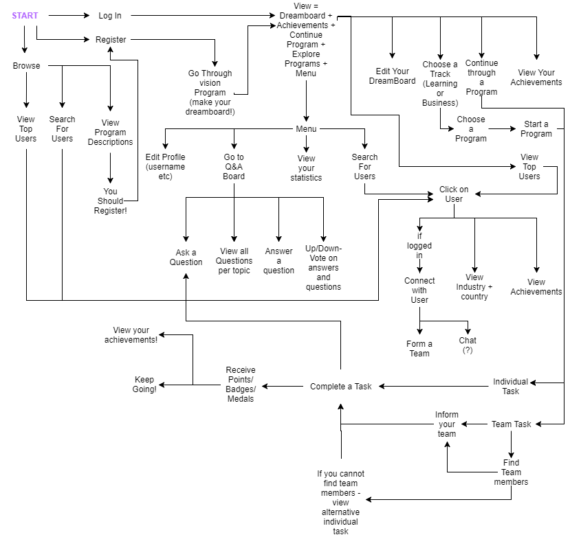

# Coding Guidelines

## Table of Content

 * [Application Structure](#structure)
 * [Coding Conventions](#coding)
 * [XML Conventions](#xml) (for designers)
 * [API Guidelines](#database)
 * [Documention Guidelines](#documentation)

## Structure

The application integrates Gradle, if you don’t understand the file/folder layout I suggest going to the Android Gradle project structure that is defined on the Android Gradle plugin user guide. http://tools.android.com/tech-docs/new-build-system/user-guide#TOC-Project-Structure

## Flow Chart

This is the layout of the application. Activities and code should be modeled after this chart


## Coding 

In general names like those seen in the examples `name_`, `s_name` , are not used.

### Exceptions 
Never ignore exceptions, ever. Your code will eventually throw an error if you do.

### Import Statements
Fully qualify any needed imports ie import foo.Bar; is good, import foo.*; is bad

### Scope
Limit the scope of all variables as much as possible. Local variables should be declared at the point they are first used

### Package names

Package names are all lowercase, with consecutive words simply concatenated together (no underscores). For example, `com.example.deepspace`, not com.example.deepSpace or com.example.deep_space.

### Class names

Class names are written in UpperCamelCase
Class names are typically nouns or noun phrases. For example, `Character` or `ImmutableList`. Interface names may also be nouns or noun phrases (for example, List), but may sometimes be adjectives or adjective phrases instead (for example, Readable).

### Method names

Method names are written in lowerCamelCase
Method names are typically verbs or verb phrases. For example, `sendMessage`, `getUser`.

### Constant names

Constant names use CONSTANT_CASE: all uppercase letters, with each word separated from the next by a single underscore. Constants are static final fields whose contents are deeply immutable and whose methods have no detectable side effects. Examples:
```java
// Constants
static final int NUMBER = 5;
static final ImmutableList<String> NAMES = ImmutableList.of("Ed", "Ann");
static final ImmutableMap<String, Integer> AGES = ImmutableMap.of("Ed", 35, "Ann", 32);
static final Joiner COMMA_JOINER = Joiner.on(','); // because Joiner is immutable
static final SomeMutableType[] EMPTY_ARRAY = {};
```
Variables
Non-public, non-static field names start with `m`.
Static field names start with `s`.
Other fields start with a lower case letter.
For example:
```java
public class MyClass {
    public static final int SOME_CONSTANT = 42;
    public int publicField;
    private static MyClass sSingleton;
    int mPackagePrivate;
    private int mPrivate;
    protected int mProtected;
}
```

Use Standard Brace Style
Braces do not go on their own line; they go on the same line as the code before them:
```java
class MyClass {
    int func() {
        if (something) {
            // ...
        } else if (somethingElse) {
            // ...
        } else {
            // ...
        }
    }
}
```

### Treat Acronyms as Words
Treat acronyms and abbreviations as words in naming variables, methods, and classes to make names more readable:
Examples:
`String URL → String url`
`ID → id`
`HTTP Request → Http Request`

### Use TODO Comments
Use TODO comments for code that is temporary, a short-term solution, or good-enough but not perfect. TODOs should include the string TODO in all caps, followed by a colon.
Examples:
```java
// TODO: Remove this code after the task has been checked.
// TODO: Fix error in table,
```


### Write Short Methods(recommendation)
When possible, keep methods small and focused. If a method exceeds 40 lines or so, think about whether it can be broken up without harming the structure of the program. We recognize that long methods are sometimes appropriate, so no hard limit is placed on method length


## XML

### Figma

The design was done in figma [here](https://www.figma.com/file/efpCXrR2bp6Tol96n6ExWBYr/ILO). Please refer to it as much as possible and contact [Robin Rhodes](https://github.com/rhodesrm) for getting access and for any design related questions.

### Resources naming
Resource IDs and names are written in lowercase_underscore.
### ID naming
IDs for resources should follow the same naming convention. `<ELEMENT>_<ACTIVITY>_<DESCRIPTION>` 
The first two components if the naming convention are pretty straight forward, the `<DESCRIPTION>` needs to be a singular word that describes what the element is. For example, if I created a textview for the user’s name the ID for that would be `text_main_name`, but if I had a textview for the username it would be `text_main_username`

| Element | Name |
|---|------|
| TextView | text |
| ImageView | image |
| Button | button |
| Menu | menu |

`*More elements are going to be added as we encounter them*`

Image view in the MainActivity example:
```java
<ImageView
    android:id="@+id/image_main_profile"
    android:layout_width="wrap_content"
    android:layout_height="wrap_content" />
```
Menu in UserActivity example:

```java
<menu>
	<item
        android:id="@+id/menu_user_done"
        android:title="Done" />
</menu>
```
Text view example:
```java
<TextView
    android:id="@+id/text_username"
    android:layout_width="wrap_content"
    android:layout_height="wrap_content" />
```


### Layout naming
Layouts are fairly simple and will follow the following convention: `<TYPE>_<DESCRIPTION>`
Where `<TYPE>` is one of the following:
 
| Prefix | Usage |
|-----|-------|
| activity | contentview for activity |
| fragment | view for a fragment |
| view | inflated by a custom view |
| item | layout used in list/recycler/gridview |
| layout | layout reused using the include tag|

`<DESCRIPTION>` Should match the name of the Java activity file, for a layout file named `activity_main`, the java file should be MainActivity, actvity_login should have a java class called in LoginActivity
Examples:
`activity_main: content view of the MainActivity`
`fragment_weather: view for the WeatherFragment`

### Strings naming
The `<WHAT>` part for Strings is irrelevant. So either we use `<WHERE>`to indicate where the string will be used:
`<ACTIVITY>_<DESCRIPTION>`, in this case activity and description hold the meaning from previous menitions 
Examples:
`main_title: title of MainActivity`
`user_id: ID for UserActivity`


## Database

For testing purposes we have implemented a temporary database hosted on Heroku. All information about the database will be provided below until we create a more robust API to be deployed with the beta version of the app.

### API url

The database is hosted on Heroku at [https://gai-database.herokuapp.com/](https://gai-database.herokuapp.com/). To interact with a specific table please append the table name to the url. The available tables are:

* users
* modules
* tasks
* badges
* user_progress
* user_badges
* user_points

For example to view all the modules, please visit [https://gai-database.herokuapp.com/modules](https://gai-database.herokuapp.com/modules).

### Table attributes

When obtaining the data via a pull request in json format you can extract the appropriate fields by attribute name. Here is a list of all the tables and the name of the attributes within them.

#### User Table

|       Column       |           Type           |       Modifiers       |
| ------------------ | ------------------------ | --------------------  |
| user_id            | integer                  | not null Primary Key  |
| user_first_name    | character varying(50)    | not null |
| user_last_name     | character varying(50)    | not null |
| user_email         | character varying(50)    | not null |
| user_password      | character varying(128)   | not null |
| user_year_birth    | integer                  | not null |
| user_date_created  | timestamp with time zone | not null |
| user_date_modified | timestamp with time zone | not null |

#### Module Table

|        Column        |           Type           |       Modifiers        |
| -------------------- | ------------------------ | ---------------------- |
| module_id            | integer                  | not null Primary Key |
| module_name          | character varying(50)    | not null |
| module_date_created  | timestamp with time zone | not null |
| module_date_modified | timestamp with time zone | not null |
| module_num_tasks     | integer                  | not null |

#### Task Table

|       Column       |           Type           |       Modifiers        |                    
| ------------------ | ------------------------ | ---------------------- |
| task_id            | integer                  | not null Primary Key |
| task_name          | character varying(50)    | not null |
| task_date_created  | timestamp with time zone | not null |
| task_date_modified | timestamp with time zone | not null |
| task_type          | character varying(25)    | not null |
| task_timer         | integer                  | not null |
| task_statement     | text                     | not null |
| task_module_id     | integer                  | not null |

#### Badge Table

|      Column       |  Type   |       Modifiers         |
|-------------------|---------|------------------------ |
| badge_id          | integer | not null Primary Key |
| badge_description | text    | not null |
| badge_points      | integer | not null |

#### User_Progress Table

|           Column           |  Type   |      Modifiers         |
|----------------------------|---------|----------------------- |
| id                         | integer | not null Primary Key |
| user_progress_module_id_id | integer | not null |
| user_progress_task_id_id   | integer | not null |
| user_progress_user_id_id   | integer | not null |

#### User_Badges Table

|         Column          |  Type   |      Modifiers        |
|-------------------------|---------|---------------------- |
| id                      | integer | not null Primary Key |
| user_badges_badge_id_id | integer | not null |
| user_badges_user_id_id  | integer | not null |

#### User_Points Table

|         Column         |  Type   |      Modifiers          |
|------------------------|---------|------------------------ |
| id                     | integer | not null Primary Key |
| user_points            | integer | not null |
| user_points_user_id_id | integer | not null |


**More Tables to come**


## Documentation

Please only upload .md or .pdf files as documentation. Pull requests with .docx files as documentation will not be accepted.
